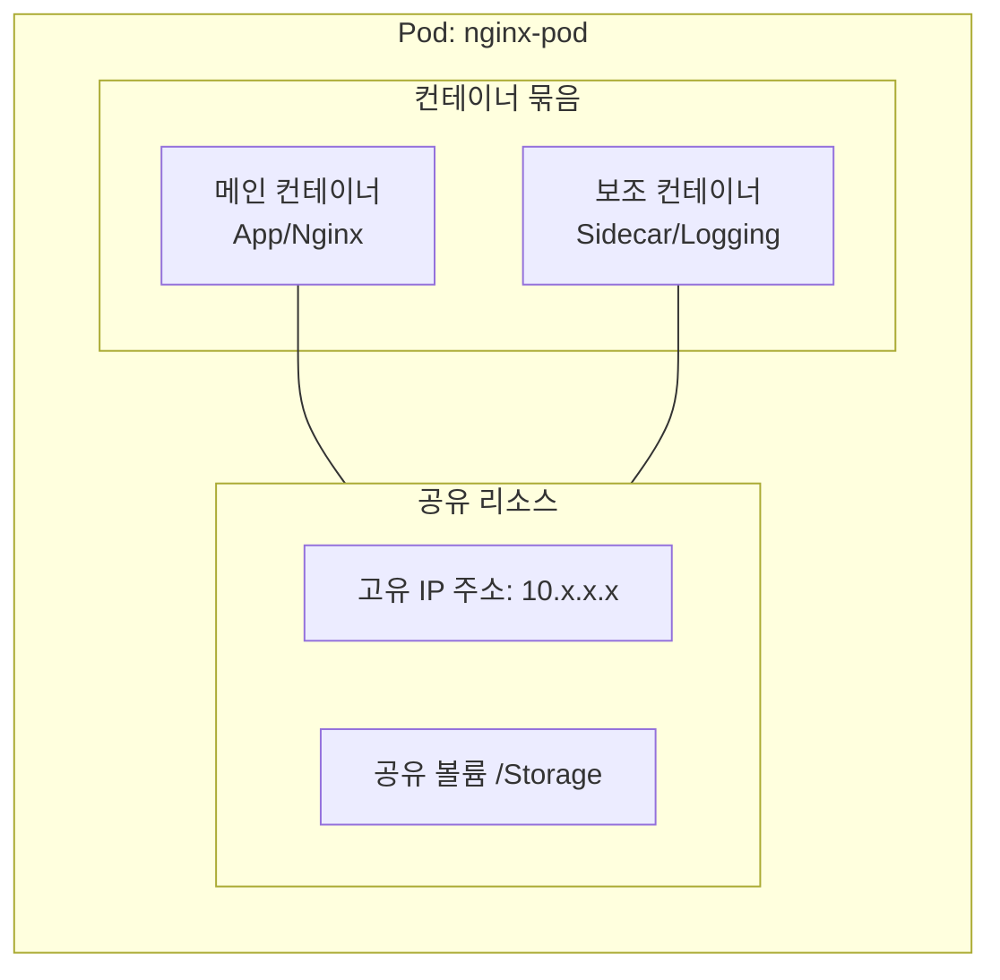

# 파드(Pod) 이해하기

쿠버네티스에서 애플리케이션을 실행하는 가장 기본적인 단위인 **파드(Pod)**에 대해 알아봅니다.

## 1. 파드(Pod)란?

도커(Docker)에서는 하나의 프로그램을 실행하는 단위를 **컨테이너**라고 불렀습니다. 쿠버네티스에서는 이 컨테이너를 하나 이상 묶어서 관리하는 단위를 **파드(Pod)**라고 부릅니다.

- **최소 배포 단위**: 쿠버네티스가 관리하는 가장 작은 오브젝트입니다.
- **하나의 실행 단위**: 일반적으로 **하나의 파드는 하나의 컨테이너**를 가집니다. (1:1 관계)
- **캡슐화**: 하나 이상의 컨테이너, 스토리지 리소스, 고유한 네트워크 IP, 그리고 컨테이너들이 어떻게 실행되어야 하는지에 대한 옵션들을 하나로 묶어 관리합니다.

### 📦 파드의 내부 구조 시각화

---

## 2. 파드의 주요 특징

### ① 네트워크 공유
파드 내의 모든 컨테이너는 **동일한 네트워크 네임스페이스**를 공유합니다. 
- 파드는 자신만의 고유한 **IP 주소**를 가집니다.
- 파드 안의 컨테이너들은 서로 `localhost`를 통해 통신할 수 있습니다. (예: App 컨테이너가 8080, DB 컨테이너가 3306 포트를 사용한다면 `localhost:3306`으로 접속 가능)

### ② 스토리지(볼륨) 공유
- 파드는 하나 이상의 공유 데이터 **볼륨**을 가질 수 있습니다.
- 파드 내의 모든 컨테이너는 이 볼륨에 동시에 접근하여 데이터를 주고받을 수 있습니다.

### ③ 일시적인 생명주기 (Ephemeral)
- 파드는 "영원히 살아있는" 존재가 아닙니다.
- 파드가 삭제되거나 장애가 발생하면 쿠버네티스는 이를 복구하는 대신 **새로운 파드**를 만들어 교체합니다. 이때 파드의 IP는 변경될 수 있습니다.

---

## 3. 쉬운 비유로 이해하기

사용자의 요청에 따라 서버를 운영하는 상황을 파드로 표현하면 다음과 같습니다.

### 💰 결제 서버 운영 예시
- **"2개의 결제 서버가 떠 있다"** 
    = "2개의 결제 서버 **파드(Pod)**가 실행 중이다."
- **"1개의 결제 서버가 죽었다"** 
    = "1개의 결제 서버 **파드(Pod)**에 장애가 발생했다."

### 📤 업로드 서버 추가 예시
- **"업로드 서버를 하나 새로 만들자"** 
    = "업로드 서버 역할을 하는 **파드(Pod)**를 하나 생성하자."

---

## 4. 왜 컨테이너를 직접 안 쓰고 파드를 쓰나요?

1.  **밀접하게 연관된 컨테이너 관리**: 로그 수집기, 데이터 로더 등 메인 서비스와 함께 붙어 다녀야 하는 보조 프로세스들을 하나의 단위로 묶어서 관리하기 위함입니다.
2.  **자원 공유의 편의성**: 여러 컨테이너가 마치 한 서버에 있는 것처럼 메모리와 파일을 쉽게 공유할 수 있도록 해줍니다.
3.  **오케스트레이션의 유연성**: 컨테이너 기술에 종속되지 않고 쿠버네티스만의 관리 체계를 갖기 위함입니다.
