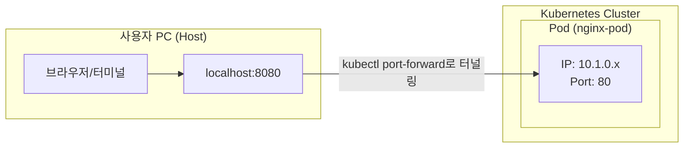
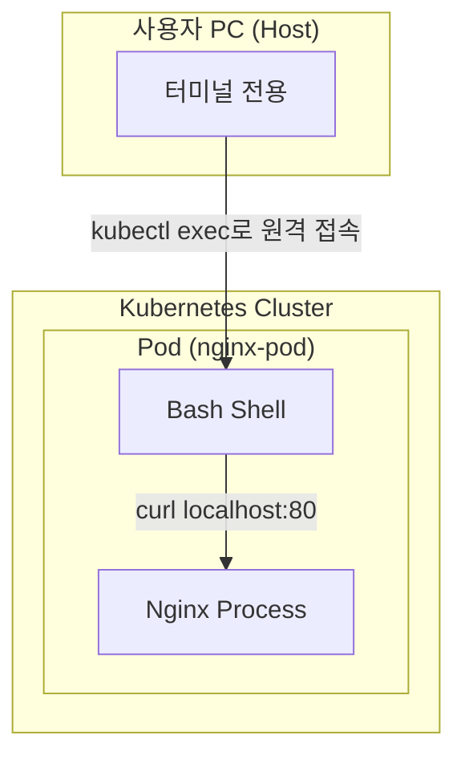

# YAML 파일을 이용한 파드(Pod) 생성하기

작성한 YAML 설정 파일을 사용하여 실제로 쿠버네티스 클러스터에 파드를 생성하고 관리하는 방법을 알아봅니다.

## 1. YAML 파일 분석 (`nginx-pod.yaml`)

쿠버네티스 오브젝트는 보통 YAML 형식의 선언적 설정 파일인 **매니페스트(Manifest) 파일**을 통해 생성합니다. (참고: [매니페스트 파일이란?](../01_concepts/manifest.md))

```yaml
apiVersion: v1         # 쿠버네티스 API 버전 (Pod는 v1 사용)
kind: Pod              # 생성하려는 오브젝트의 종류
metadata:
  name: nginx-pod      # 파드의 고유 이름
spec:                  # 상세 사양 (컨테이너 정보 등)
  containers:
    - name: nginx-container
      image: nginx     # 사용할 도커 이미지
      ports:
        - containerPort: 80  # [중요] 컨테이너가 내부에서 리스닝하는 포트
```

### 💡 `containerPort`에 대한 오해 풀기
초보자들이 가장 많이 헷갈려 하는 부분입니다.
- **이 포트는 외부에서 접속하는 포트가 아닙니다.**
- **컨테이너 내부**에서 애플리케이션(예: Nginx)이 실행되고 있는 포트를 의미합니다.
- 단순히 "이 컨테이너는 80번 포트를 사용해요"라고 정보를 제공하는 역할이 강하며, 실제로 외부에서 이 포트로 바로 접속할 수는 없습니다. (외부 노출을 위해서는 나중에 배울 **Service**가 필요합니다.)

---

## 2. 왜 `localhost:80`으로 접속이 안 되나요?

파드를 성공적으로 띄웠는데 브라우저에서 `localhost:80`으로 접속하면 연결이 안 될 것입니다. 그 이유는 다음과 같습니다.

1.  **네트워크 격리**: 파드는 쿠버네티스 클러스터 내부의 독립된 네트워크 공간(Namespace)에 존재하며, 자신만의 가상 IP를 가집니다.

    ```mermaid
    graph LR
        subgraph "사용자 PC (Host)"
            A[브라우저/터미널]
            L[localhost:80]
        end

        subgraph "Kubernetes Cluster"
            subgraph "Pod (nginx-pod)"
                P[IP: 10.1.0.x<br/>Port: 80]
            end
        end

        A -- "접속 시도 (X)" --> L
        A -. "직접 접속 불가 (격리)" .-> P
        style L fill:#f9f,stroke:#333,stroke-dasharray: 5 5
    ```
2.  **localhost의 의미**: 여러분의 PC(호스트)에서 `localhost`는 파드가 아니라 **여러분 자신의 PC**를 가리킵니다. PC의 80번 포트에는 아무것도 떠 있지 않기 때문에 접속이 안 되는 것이 당연합니다.
3.  **포트 맵핑 부재**: Docker에서는 `-p 80:80` 같은 옵션으로 호스트와 컨테이너 포트를 연결해주었지만, 쿠버네티스 파드 매니페스트의 `containerPort`는 그런 연결 기능을 수행하지 않습니다.

### 🔍 임시로 접속 확인해보기 1: Port Forwarding
서비스(Service)를 배우기 전, PC에서 파드가 잘 작동하는지 확인하고 싶다면 아래 명령어를 사용해 보세요.
```bash
# 호스트의 8080 포트를 파드의 80 포트로 연결
kubectl port-forward pod/nginx-pod 8080:80
```

**실행 결과:**
```text
Forwarding from 127.0.0.1:8080 -> 80
Forwarding from [::1]:8080 -> 80
Handling connection for 8080
```
이제 브라우저에서 `localhost:8080`으로 접속하면 Nginx 페이지가 보일 것입니다! (확인 후 터미널에서 `Ctrl + C`로 종료하세요.)

#### 🖼️ Port Forwarding의 원리


---

### 🔍 임시로 접속 확인해보기 2: 파드 내부로 접속 (exec)
도커에서 컨테이너 내부로 접속할 때 `docker exec`를 사용하는 것처럼, 쿠버네티스에서도 `kubectl exec` 명령어를 사용하여 실행 중인 파드 내부 환경으로 들어갈 수 있습니다.

```bash
# nginx-pod 내부의 bash 쉘로 접속
kubectl exec -it nginx-pod -- bash
```

**실행 결과:**
```text
root@nginx-pod:/#
```

파드 내부로 성공적으로 접속했다면, 파드 안에서 직접 Nginx에게 요청을 보내볼 수 있습니다.
```bash
# --- Pod 내부 접속 상태 ---
curl localhost:80
```

**실행 결과:**
```html
<!DOCTYPE html>
<html>
<head>
<title>Welcome to nginx!</title>
...
<h1>Welcome to nginx!</h1>
```

#### 🖼️ 파드 내부 접속(exec) 및 내부 통신 원리


---

## 3. 파드 생성 및 확인 명령어

### ① 파드 생성하기
터미널에서 아래 명령어를 입력하여 YAML 파일에 정의된 파드를 생성합니다.
```bash
kubectl apply -f 01_pods/nginx-pod.yaml
```
**실행 결과:**
```text
pod/nginx-pod created
```

### ② 파드 상태 확인하기
생성된 파드가 정상적으로 실행 중인지 확인합니다.
```bash
kubectl get pods
```
**실행 결과:**
```text
NAME        READY   STATUS    RESTARTS   AGE
nginx-pod   1/1     Running   0          30s
```
- `STATUS`가 `Running`이면 정상입니다.

### ③ 파드 상세 정보 보기
파드의 IP 주소, 상태 로그 등 더 자세한 정보를 확인하고 싶을 때 사용합니다.
```bash
kubectl describe pod nginx-pod
```
**실행 결과 (일부):**
```text
Name:             nginx-pod
Namespace:        default
Priority:         0
Node:             docker-desktop/192.168.65.3
Start Time:       Mon, 09 Feb 2026 11:25:26 +0900
Labels:           <none>
Status:           Running
IP:               10.1.0.6
Containers:
  nginx-container:
    Image:          nginx
    Port:           80/TCP
    State:          Running
...
```

---

## 3. 파드 삭제하기

실습이 끝난 후 파드를 삭제하려면 아래 명령어를 사용합니다.
```bash
kubectl delete -f 01_pods/nginx-pod.yaml
# 또는
kubectl delete pod nginx-pod
```
