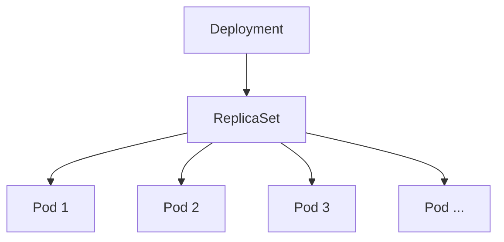

# 디플로이먼트(Deployment)란?

### ✅ 디플로이먼트(Deployment)란?

<aside>
💡 **[First Word 법칙]**  
**디플로이먼트(Deployment) : 파드를 묶음으로 쉽게 관리할 수 있는 기능**
</aside>

현업에서는 일반적으로 서버를 작동시킬 때 파드(Pod)를 수동으로 배포하지 않습니다. **디플로이먼트(Deployment)**라는 오브젝트를 활용해서 파드(Pod)를 자동으로 배포하고 관리합니다.

---

### ✅ 디플로이먼트(Deployment)의 장점

- **파드 수 자동 유지 (Desired State)**: 파드의 수를 지정하는 대로 여러 개의 파드를 쉽게 생성할 수 있습니다.
    - 예: 파드를 100개 생성하라고 명시하면, 디플로이먼트가 알아서 파드 100개를 실행합니다.
- **셀프 힐링 (Self-healing)**: 파드가 비정상적으로 종료되거나 노드에 문제가 생기면, 디플로이먼트가 이를 감지하고 알아서 새로운 파드를 생성해 지정된 파드 수를 유지합니다.
- **일괄 관리 (Batch Management)**: 동일한 구성의 여러 파드를 한 번에 일시 중지, 삭제, 업데이트하기가 매우 쉽습니다.
    - 예: 결제 서버 100개를 운영 중일 때, 디플로이먼트 설정 하나만 바꾸면 100개의 서버가 한 번에 최신 버전으로 업데이트됩니다.

---

### ✅ 디플로이먼트(Deployment)의 구조

디플로이먼트는 직접 파드를 관리하는 것이 아니라, **레플리카셋(ReplicaSet)**이라는 중간 객체를 통해 파드를 관리하는 계층 구조를 가지고 있습니다.

- **디플로이먼트(Deployment)**: 애플리케이션의 배포 버전과 업데이트 전략을 관리합니다.
- **레플리카셋(ReplicaSet)**: 정해진 수의 복제본(Replica) 파드가 항상 실행되도록 보장합니다.
    - **레플리카(Replica)**: 복제본
    - **레플리카셋(ReplicaSet)**: 복제본끼리의 묶음
- **파드(Pod)**: 실제 애플리케이션 컨테이너가 실행되는 최소 단위입니다.

