# [예제] 서비스(Service)를 활용해 백엔드(Spring Boot) 서버와 통신해보기

### ✅ 서비스(Service)를 활용해 백엔드(Spring Boot)와 통신해보기

<aside>
🧑🏻‍🏫 **교안**  
이전 실습에서 디플로이먼트를 활용해 백엔드 서버(Spring Boot) 3개를 띄웠다. 하지만 디플로이먼트에 포함되어 있는 모든 파드에 골고루 요청을 분배하기 위해 서비스(Service)를 생성해야 한다.
</aside>

---

### 1. 매니페스트 파일 작성하기 (`spring-service.yaml`)

외부에서 접속 가능하도록 `NodePort` 타입의 서비스를 정의한다.

> **💡 순서가 중요할까?**
> 쿠버네티스에서는 서비스와 디플로이먼트 중 무엇을 먼저 생성해도 상관없다. 서비스는 `selector`를 통해 파드를 찾는데, 파드가 나중에 생성되더라도 라벨만 일치하면 서비스가 자동으로 감지하여 연결하기 때문이다. 하지만 일반적으로는 대상이 되는 파드(디플로이먼트)를 먼저 띄워놓고 서비스를 연결하는 것이 흐름상 자연스럽다.

```yaml
apiVersion: v1
kind: Service
metadata:
  name: spring-service
spec:
  type: NodePort # 외부 접속을 허용하는 서비스 타입
  selector:
    app: backend-app # 'app: backend-app' 라벨을 가진 파드들을 타겟으로 지정
  ports:
    - protocol: TCP
      port: 8080       # 서비스 내부 포트
      targetPort: 8080 # 파드(컨테이너) 내부 포트
      nodePort: 30000  # 외부에서 접속할 포트 (30000-32767 사이)
```

#### 💡 서비스 타입 이해하기

1.  **NodePort**: 모든 노드의 특정 포트(여기서는 30000번)를 열어 외부 접속을 허용한다.
2.  **ClusterIP**: 클러스터 내부에서만 통신 가능한 고정 IP를 부여한다. (기본값)
3.  **LoadBalancer**: 클라우드 환경(AWS 등)에서 외부 로드밸런서를 자동으로 생성하여 연결한다.

---

### 2. 서비스 생성하기

작성한 매니페스트 파일을 클러스터에 적용한다.

```bash
$ kubectl apply -f 03_deployment_service/spring-service.yaml
```

**실행 결과:**
```text
service/spring-service created
```

---

### 3. 생성 결과 확인하기

서비스가 정상적으로 생성되었는지 확인한다.

```bash
$ kubectl get service
```

**실행 결과:**
```text
NAME             TYPE        CLUSTER-IP      EXTERNAL-IP   PORT(S)          AGE
kubernetes       ClusterIP   10.96.0.1       <none>        443/TCP          24h
spring-service   NodePort    10.104.22.184   <none>        8080:30000/TCP   10s
```

- `PORT(S)` 항목을 보면 내부 `8080` 포트가 외부 `30000` 포트로 매핑된 것을 볼 수 있다.

---

### 4. 접속 확인 및 로드 밸런싱 테스트

이제 브라우저나 터미널에서 `localhost:30000`으로 접속하여 통신이 되는지 확인한다.

```bash
$ curl localhost:30000
```

#### 🖼️ 전체 구조도

```mermaid
graph LR
    User((사용자)) -- "접속 (localhost:30000)" --> Service[Service: spring-service]
    
    subgraph "Kubernetes Cluster"
        Service -- "트래픽 분산 (TargetPort: 8080)" --> Pod1
        Service -- "트래픽 분산" --> Pod2
        Service -- "트래픽 분산" --> Pod3
        
        subgraph "Pods (Deployment)"
            Pod1["Pod: backend-1<br/>(label: app=backend-app)"]
            Pod2["Pod: backend-2<br/>(label: app=backend-app)"]
            Pod3["Pod: backend-3<br/>(label: app=backend-app)"]
        end
    end
```



서비스는 `selector`에 명시된 `app: backend-app` 라벨을 가진 모든 파드들을 자동으로 찾아 트래픽을 고르게 분산해 준다. 파드 하나에 장애가 생겨 교체되더라도 서비스의 접속 주소는 변하지 않으므로 안정적인 통신이 가능하다.
