# [실습] 볼륨(Volume)을 활용해 MySQL 데이터 보존하기

### ✅ 목표
쿠버네티스에서 파드가 재시작되어도 MySQL의 데이터가 사라지지 않도록 **퍼시스턴트 볼륨(PV)**과 **퍼시스턴트 볼륨 클레임(PVC)**을 설정하고 검증한다.

---

### 1. PV 및 PVC 정의

데이터를 저장할 실제 공간(PV)과 이를 요청할 권한(PVC)을 정의한다.

**mysql-pv.yaml**
```yaml
apiVersion: v1
kind: PersistentVolume
metadata:
  name: mysql-pv
spec:
  storageClassName: my-storage
  capacity: 
    storage: 1Gi
  accessModes:
    - ReadWriteOnce
  hostPath:
    path: "/mnt/data"
```

**mysql-pvc.yaml**
```yaml
apiVersion: v1
kind: PersistentVolumeClaim
metadata:
  name: mysql-pvc
spec:
  storageClassName: my-storage
  accessModes:
    - ReadWriteOnce
  resources:
    requests:
      storage: 1Gi
```

---

### 2. 디플로이먼트(Deployment) 수정

생성한 PVC를 MySQL 컨테이너의 데이터 디렉토리(`/var/lib/mysql`)에 마운트하도록 설정한다.

**mysql-deployment.yaml** (주요 변경 사항)
```yaml
...
    spec:
      containers:
        - name: mysql-container
          image: mysql:8.0
          ...
          volumeMounts:
            - name: mysql-persistent-storage
              mountPath: /var/lib/mysql # 데이터가 저장되는 경로
      volumes:
        - name: mysql-persistent-storage
          persistentVolumeClaim:
            claimName: mysql-pvc # PVC 이름과 일치해야 함
```

---

### 3. 리소스 적용 및 상태 확인

```bash
# 매니페스트 적용
$ kubectl apply -f 05_volume/mysql-pv.yaml
$ kubectl apply -f 05_volume/mysql-pvc.yaml
$ kubectl apply -f 05_volume/mysql-deployment.yaml

# PV/PVC 연결 상태 확인 (STATUS가 Bound여야 함)
$ kubectl get pv,pvc
```

---

### 4. 데이터 보존 테스트

#### 1) 새로운 데이터베이스 생성
```bash
$ kubectl exec -it deployment/mysql-deployment -- mysql -u root -ppassword123 -e "CREATE DATABASE new_db; SHOW DATABASES;"
```
*결과: `new_db`가 목록에 나타남*

#### 2) 디플로이먼트 재시작
파드를 강제로 삭제하고 새로 생성하여 데이터 유실 여부를 확인한다.
```bash
$ kubectl rollout restart deployment mysql-deployment
$ kubectl rollout status deployment mysql-deployment
```

#### 3) 데이터베이스 재확인
```bash
$ kubectl exec -it deployment/mysql-deployment -- mysql -u root -ppassword123 -e "SHOW DATABASES;"
```

**검증 결과:**
```text
+--------------------+
| Database           |
+--------------------+
| information_schema |
| kub-practice       |
| mysql              |
| new_db             |  <-- 데이터가 유지됨!
| performance_schema |
| sys                |
+--------------------+
```

---

### ✅ 결론
- **데이터 지속성 확보**: PV/PVC를 통해 컨테이너 내부가 아닌 호스트(또는 외부 저장소)에 데이터를 저장함으로써 파드 재시작 후에도 데이터가 유지됨을 확인했다.
- **Stateful 애플리케이션**: 데이터베이스와 같이 상태를 유지해야 하는 애플리케이션은 반드시 볼륨 설정이 필요하다.

---

### 🎨 MySQL 볼륨 구조 시각화

#### 1. 볼륨 연결 구조도

```mermaid
graph TD
    subgraph K8s [Kubernetes Cluster]
        subgraph MySQL_Pod [Pod MySQL]
            Container["MySQL Container"]
            MountPath["/var/lib/mysql (데이터 저장 경로)"]
            Container -- "1. Mounts to" --> MountPath
        end

        PVC["PersistentVolumeClaim (mysql-pvc)"]
        PV["PersistentVolume (mysql-pv)"]

        MountPath -- "2. Requests storage via" --> PVC
        PVC -- "3. Bound to (by storageClassName)" --> PV
    end

    subgraph Storage [Physical Storage Node/Host]
        HostPath["/mnt/data (실제 데이터 저장 위치)"]
    end

    PV -- "4. Maps to" --> HostPath
```


#### 2. 왜 PVC를 통해 PV에 연결할까요? (구조적 이유)

쿠버네티스에서 컨테이너와 저장소를 직접 연결하지 않고 PVC라는 중간 단계를 두는 이유는 **"인프라의 복잡성을 사용자(개발자)로부터 숨기기 위함"**입니다.

1.  **관심사의 분리 (Separation of Concerns)**:
    *   **인프라 관리자**: 실제 저장 장치(SSD, HDD, Cloud Storage 등)를 준비하고 **PV**를 생성합니다.
    *   **개발자**: 저장소의 상세 스펙은 몰라도 됩니다. 단지 "1Gi 용량이 필요해"라고 **PVC**를 통해 요청만 하면 됩니다.
2.  **이식성 (Portability)**:
    *   로컬 환경에서는 `hostPath`를 사용하는 PV가 연결될 수 있고, 클라우드 환경(AWS, GCP 등)에서는 각 환경에 맞는 클라우드 스토리지가 연결될 수 있습니다.
    *   **Deployment YAML은 수정할 필요 없이** 환경에 따라 적절한 PV가 PVC에 자동으로 연결(Binding)됩니다.
3.  **유연한 관리**:
    *   저장소 장치가 바뀌거나 확장되더라도 PVC를 사용하는 애플리케이션은 중단 없이 동일한 방식으로 데이터에 접근할 수 있습니다.

#### 3. YAML 파일 간의 연결 고리
| 단계 | 연결 항목 | 핵심 설정값 (YAML) | 설명 |
| :--- | :--- | :--- | :--- |
| **1** | **Container ↔ PVC** | `volumes.persistentVolumeClaim.claimName: mysql-pvc` | Pod가 사용할 PVC 이름을 지정합니다. |
| **2** | **Container ↔ Mount** | `volumeMounts.mountPath: /var/lib/mysql` | 컨테이너 내부 경로와 볼륨을 연결합니다. |
| **3** | **PVC ↔ PV** | `storageClassName: my-storage` | 클래스 이름이 같으면 PV와 PVC가 연결(Bound)됩니다. |
| **4** | **PV ↔ 실제 저장소** | `hostPath.path: /mnt/data` | 실제 데이터가 저장될 노드의 물리적 경로입니다. |
