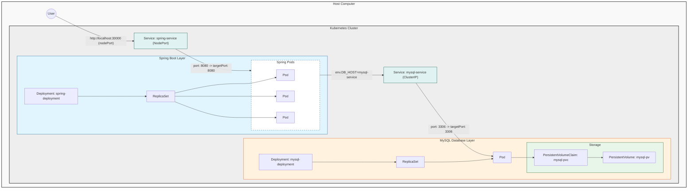

# [예제] 백엔드(Spring Boot) 서버와 MySQL 연동하기

### ✅ 목표
- Spring Boot 서버를 Docker 이미지로 빌드해 쿠버네티스에 배포하고, 기존에 실행 중인 `mysql-service`를 통해 MySQL과 연동한다.
- 애플리케이션 재시작/스케일링 상황에서도 DB 연결이 정상적으로 유지되는지 확인한다.

---

## 1. Spring Boot 프로젝트 셋업 (Java 17)

- 디렉토리: `05_volume/springapp`
- 주요 파일
  - `src/main/java/com/example/demo/DemoApplication.java`
  - `src/main/resources/application.yml`
  - `build.gradle`, `settings.gradle`
  - `Dockerfile`

#### DemoApplication.java
```java
package com.example.demo;

import org.springframework.boot.SpringApplication;
import org.springframework.boot.autoconfigure.SpringBootApplication;
import org.springframework.web.bind.annotation.GetMapping;
import org.springframework.web.bind.annotation.RestController;

@SpringBootApplication
public class DemoApplication {
    public static void main(String[] args) {
        SpringApplication.run(DemoApplication.class, args);
    }
}

@RestController
class AppController {
    @GetMapping("/")
    public String home() {
        return "Hello, World!";
    }
}
```

#### application.yml
```yaml
spring:
  datasource:
    # 환경 변수를 통해 DB 연결 정보를 동적으로 받습니다.
    # 쿠버네티스 Deployment의 env 설정에서 이 값들을 주입해줍니다.
    url: jdbc:mysql://${DB_HOST}:${DB_PORT}/${DB_NAME}
    username: ${DB_USERNAME}
    password: ${DB_PASSWORD}
    driver-class-name: com.mysql.cj.jdbc.Driver
  jpa:
    hibernate:
      ddl-auto: update # 애플리케이션 실행 시 테이블 자동 생성/수정
    show-sql: true     # 실행되는 SQL 쿼리를 로그에 출력
```

#### build.gradle (Java 17, Spring Boot 3.x)
```groovy
plugins {
    id 'java'
    id 'org.springframework.boot' version '3.3.2'
    id 'io.spring.dependency-management' version '1.1.6'
}

group = 'com.example'
version = '0.0.1-SNAPSHOT'
java {
    sourceCompatibility = JavaVersion.VERSION_17
}

repositories {
    mavenCentral()
}

dependencies {
    developmentOnly 'org.springframework.boot:spring-boot-devtools'
    implementation 'org.springframework.boot:spring-boot-starter-web'
    implementation 'org.springframework.boot:spring-boot-starter-data-jpa'
    runtimeOnly 'com.mysql:mysql-connector-j'
    testImplementation 'org.springframework.boot:spring-boot-starter-test'
}

tasks.named('test') {
    useJUnitPlatform()
}
```

#### Dockerfile
```dockerfile
# Java 17을 실행할 수 있는 가벼운 슬림 이미지를 기반으로 사용합니다.
FROM openjdk:17-jdk-slim

# Gradle 빌드를 통해 생성된 JAR 파일을 컨테이너 내부의 app.jar로 복사합니다.
COPY build/libs/*.jar app.jar

# 컨테이너가 시작될 때 JAR 파일을 실행하도록 설정합니다.
ENTRYPOINT ["java", "-jar", "/app.jar"]
```

---

## 2. 빌드 & 이미지 생성

```bash
# 프로젝트 루트 기준
$ cd 05_volume/springapp

# (옵션) Gradle Wrapper가 없으면 시스템 Gradle 사용 가능
$ ./gradlew clean build   # 또는: gradle clean build

# Docker 이미지 빌드
$ docker build -t spring-server .
```

> 빌드 성공 시 `build/libs` 하위에 `*-SNAPSHOT.jar`가 생성된다.

---

## 3. 쿠버네티스 매니페스트 작성 및 배포

이미 존재하는 `mysql-service` (NodePort 30004)를 사용해 DB에 접속한다.

### spring-deployment.yaml
```yaml
apiVersion: apps/v1
kind: Deployment # 애플리케이션의 배포 상태를 관리하는 오브젝트
metadata:
  name: spring-deployment # Deployment의 이름
spec:
  replicas: 3 # 파드를 3개 띄워 가용성을 확보하고 부하를 분산합니다.
  selector:
    matchLabels:
      app: backend-app # 아래 template에 정의된 레이블과 일치해야 합니다.
  template:
    metadata:
      labels:
        app: backend-app # 이 레이블을 가진 파드들을 Deployment가 관리합니다.
    spec:
      containers:
        - name: spring-container
          image: spring-server # 우리가 빌드한 Docker 이미지 이름
          imagePullPolicy: IfNotPresent # 로컬에 이미지가 있으면 새로 다운로드하지 않고 사용합니다.
          ports:
            - containerPort: 8080 # 컨테이너 내부에서 사용할 포트
          env: # 애플리케이션에 주입할 환경 변수 설정
            - name: DB_HOST
              value: mysql-service # MySQL 서비스의 이름을 입력하면 쿠버네티스 DNS가 IP로 변환해줍니다.
            - name: DB_PORT
              value: "3306" # 숫자는 반드시 따옴표로 감싸서 문자열로 표기해야 합니다.
            - name: DB_NAME
              value: kub-practice # 사용할 데이터베이스 이름
            - name: DB_USERNAME
              value: root # DB 사용자 ID
            - name: DB_PASSWORD
              value: password123 # DB 비밀번호
          readinessProbe: # 파드가 트래픽을 받을 준비가 되었는지 체크
            httpGet:
              path: /
              port: 8080
            initialDelaySeconds: 10 # 컨테이너 시작 후 10초 뒤부터 체크 시작
            periodSeconds: 5        # 5초마다 주기적으로 체크
          livenessProbe: # 컨테이너가 살아있는지 체크하여 문제 발생 시 재시작
            httpGet:
              path: /
              port: 8080
            initialDelaySeconds: 30 # 충분히 앱이 기동될 시간을 준 뒤(30초) 체크 시작
            periodSeconds: 10
```

### spring-service.yaml
```yaml
apiVersion: v1
kind: Service # 파드를 외부 네트워크에 노출시키기 위한 오브젝트
metadata:
  name: spring-service # 서비스 이름
spec:
  type: NodePort # 외부에서 접근 가능하도록 노드 포트를 엽니다.
  selector:
    app: backend-app # 'app: backend-app' 레이블을 가진 파드들로 트래픽을 전달합니다.
  ports:
    - protocol: TCP
      port: 8080       # 서비스 내부에서 사용하는 포트
      targetPort: 8080 # 파드(컨테이너)의 대상 포트
      nodePort: 30000  # 실제 외부(localhost:30000)에서 접속할 포트
```

### 배포 명령어
```bash
$ kubectl apply -f 05_volume/spring-deployment.yaml
$ kubectl apply -f 05_volume/spring-service.yaml

# 확인
$ kubectl get deploy,pod,svc -l app=backend-app
```

---

## 4. 동작 확인 (MySQL 연동)

- 브라우저 또는 curl로 애플리케이션 확인
```bash
$ curl http://localhost:30000/
# Hello, World!
```

- 스프링 앱 파드에서 DB 환경변수 확인
```bash
$ kubectl exec -it deploy/spring-deployment -- printenv | grep DB_
```

- MySQL과의 연결은 `application.yml`의 `${DB_*}` 값으로 설정되며, `mysql-service`로 내부 DNS 통신한다.

---

## 5. 전체 구조도 (상세 아키텍처)

아래 그림은 사용자 요청이 Spring 서버를 거쳐 MySQL 데이터베이스에 도달하고, 데이터가 볼륨에 저장되는 전체 과정을 상세히 나타냅니다.




| 구성 요소 | 설명 |
| :--- | :--- |
| **User** | 브라우저나 `curl`을 통해 `localhost:30000`으로 접속하는 외부 사용자입니다. |
| **spring-service** | 외부의 `30000` 포트 요청을 받아 내부 파드들의 `8080` 포트로 전달(로드 밸런싱)합니다. |
| **Spring Pods** | 실제 애플리케이션이 실행되는 3개의 복제본입니다. |
| **mysql-service** | Spring 파드들이 `mysql-service`라는 이름으로 DB에 접속할 수 있게 해주는 내부 이정표입니다. |
| **MySQL Pod** | 데이터베이스 엔진이 실행되는 파드입니다. |
| **PV / PVC** | 파드가 재시작되어도 데이터가 사라지지 않도록 호스트의 물리 저장소와 연결된 볼륨 계층입니다. |

---

## 6. 트러블슈팅 팁
- 드라이버 누락: IDE/로컬에서 실행 시 MySQL 드라이버 버전 호환 확인
- DB 비밀번호 오류: Secret/환경변수 값과 일치하는지 재확인
- 클러스터 DNS: `mysql-service` 이름이 정확한지, 네임스페이스 동일한지 확인
- 이미지 Pull 이슈: `imagePullPolicy: IfNotPresent` 설정 또는 로컬에서 직접 빌드 후 사용

---

## 7. 만약 MySQL과 연결이 제대로 되지 않았다면?

데이터베이스 연결 정보(비밀번호 등)가 잘못되었을 때 어떤 현상이 발생하는지 확인하고 해결하는 방법을 알아봅니다.

### 1) 매니페스트 파일 수정 (오류 유도)
일부러 틀린 비밀번호를 설정하여 연결 실패를 유도해봅니다.

**spring-deployment.yaml**
```yaml
...
          env:
            - name: DB_PASSWORD
              value: "wrong-password" # 일부러 틀린 비밀번호 입력
...
```

### 2) 설정 반영 및 재시작
```bash
$ kubectl apply -f 05_volume/spring-deployment.yaml
$ kubectl rollout restart deployment spring-deployment
```

### 3) 상태 확인 및 에러 분석
파드의 상태를 확인하면 정상적으로 기동되지 않는 것을 볼 수 있습니다.

```bash
$ kubectl get pods
```

**[에러 메시지 확인]**
`kubectl logs` 명령어를 통해 상세한 에러 로그를 확인하면 DB 접속 권한 오류(`Access denied`) 메시지를 발견할 수 있습니다.

```bash
$ kubectl logs [파드명]
```

**예상되는 에러 로그:**
```text
2024-05-20 12:34:56.789 ERROR 1 --- [main] com.zaxxer.hikari.pool.HikariPool        : HikariPool-1 - Exception during pool initialization.

java.sql.SQLException: Access denied for user 'root'@'10.244.0.5' (using password: YES)
	at com.mysql.cj.jdbc.exceptions.SQLError.createSQLException(SQLError.java:130) ~[mysql-connector-j-8.0.33.jar:8.0.33]
	at com.mysql.cj.jdbc.exceptions.SQLExceptionsMapping.translateException(SQLExceptionsMapping.java:122) ~[mysql-connector-j-8.0.33.jar:8.0.33]
    ...
2024-05-20 12:34:56.790  WARN 1 --- [main] ConfigServletWebServerApplicationContext : Exception encountered during context initialization - cancelling refresh attempt: org.springframework.context.ApplicationContextException: Failed to btain Bean 'entityManagerFactory'; nested exception is javax.persistence.PersistenceException: [PersistenceUnit: default] Unable to build Hibernate SessionFactory; nested exception is org.hibernate.exception.GenericJDBCException: Cannot open connection
```

### 4) 다시 올바른 정보로 복구
비밀번호를 원래대로(`password123`) 수정하고 다시 배포합니다.

**spring-deployment.yaml**
```yaml
...
          env:
            - name: DB_PASSWORD
              value: "password123" # 올바른 비밀번호로 수정
...
```

```bash
$ kubectl apply -f 05_volume/spring-deployment.yaml
$ kubectl rollout restart deployment spring-deployment
```

정상적으로 `Running` 상태가 되는 것을 확인합니다.

```bash
$ kubectl get pods
```

---

### ✅ 마무리
- Spring Boot 서버가 쿠버네티스에서 실행 중인 MySQL과 서비스 디스커버리(`mysql-service`)를 통해 안정적으로 연동됨을 확인했다.
- 스케일 아웃(레플리카 3) 상황에서도 동일한 설정으로 DB에 접근 가능하다.
