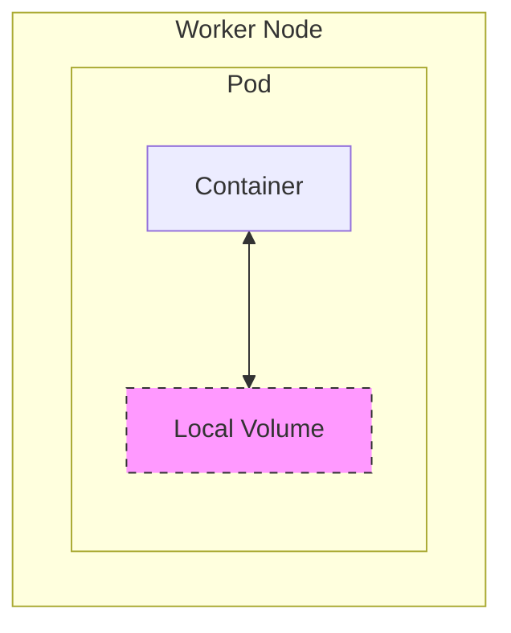
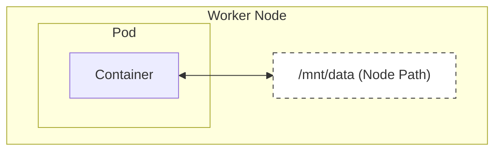
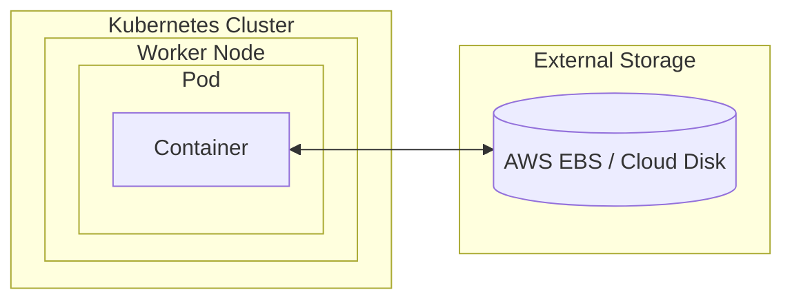
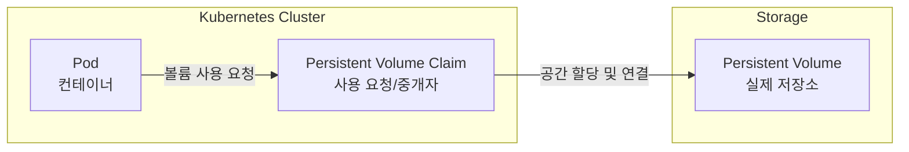

# 볼륨(Volume)이란?

### ✅ 파드(Pod)가 가진 문제점

쿠버네티스를 활용하면 특정 프로그램을 파드로 띄울 수 있다. 이 프로그램에 기능이 추가되면 쿠버네티스는 기존 파드에서 변경된 부분을 수정하지 않고, 새로운 파드를 만들어서 통째로 갈아끼우는 방식으로 교체를 한다. 이것은 쿠버네티스의 핵심 철학인 **불변성(Immutability)**에 기반한 효율적인 방식이다.

하지만 이런 특징 때문에 기존 파드를 새로운 파드로 교체하면, **기존 파드 내부에 있던 데이터도 같이 삭제된다.** 만약 이 파드가 MySQL을 실행시키는 파드였다면, 파드가 업데이트되거나 재시작될 때 MySQL에 저장된 데이터도 함께 사라지게 된다.

따라서 파드 내부에 저장된 데이터가 삭제되면 안 되는 경우에는 **볼륨(Volume)**이라는 개념을 활용해야 한다.

---

### ✅ 쿠버네티스의 볼륨(Volume)이란?

**볼륨(Volume)**이란 **데이터를 영속적으로 저장하기 위한 방법**이다. 쿠버네티스에서 볼륨은 크게 2가지 종류로 나뉜다.

#### 1. 로컬 볼륨 (Ephemeral Volume)
**파드 내부의 공간 일부를 볼륨으로 활용하는 방식**이다. 이 방식은 파드가 삭제되는 즉시 데이터도 함께 삭제된다. 임시 데이터를 저장하는 용도로는 쓰이지만, 중요한 데이터를 저장하기에는 부적합하여 실제로 영구 저장을 위해 사용되는 일은 거의 없다.

#### 2. 퍼시스턴트 볼륨 (Persistent Volume, PV)
**파드 외부의 공간 일부를 볼륨으로 활용하는 방식**이다. 이 방식은 파드가 삭제되는 것과 상관없이 데이터를 영구적으로 사용할 수 있다는 장점이 있다. 현업에서는 주로 이 방식을 활용한다.

- **클러스터 내부 저장소 활용**: 쿠버네티스 노드의 특정 경로를 공유하여 사용한다.

- **외부 저장소 활용**: AWS EBS, Google Cloud Persistent Disk, NFS 등 외부 스토리지 서비스를 연결하여 사용한다.

---

### ✅ 퍼시스턴트 볼륨 클레임 (Persistent Volume Claim, PVC)이란?

실제로는 파드(Pod)가 퍼시스턴트 볼륨(PV)에 직접 연결할 수 없다. **퍼시스턴트 볼륨 클레임(PVC)**이라는 중개자가 있어야 한다. 

- **PV (Persistent Volume)**: 실제 저장 공간 (서버나 클라우드 스토리지). "내가 10GB 공간을 준비해뒀어."
- **PVC (Persistent Volume Claim)**: 파드가 PV에 요청하는 티켓. "나 5GB 공간이 필요해, 연결해줘."

쿠버네티스에서는 아래와 같은 구조로 데이터를 영구적으로 저장한다.

이 구조를 통해 개발자는 실제 물리적인 저장소가 어디에 있는지(PV) 몰라도, 필요한 만큼의 용량만 요청(PVC)하면 파드에 볼륨을 연결해 사용할 수 있다.

---

### ✅ 요약

1.  **Pod**: 언제든 삭제되고 다시 생성될 수 있는 일회성 존재다.
2.  **Volume**: 파드가 삭제되어도 데이터를 유지하기 위해 사용한다.
3.  **PV & PVC**: 실제 저장소(PV)와 사용 요청(PVC)을 분리하여 관리함으로써 효율적이고 안전하게 데이터를 보관한다.
