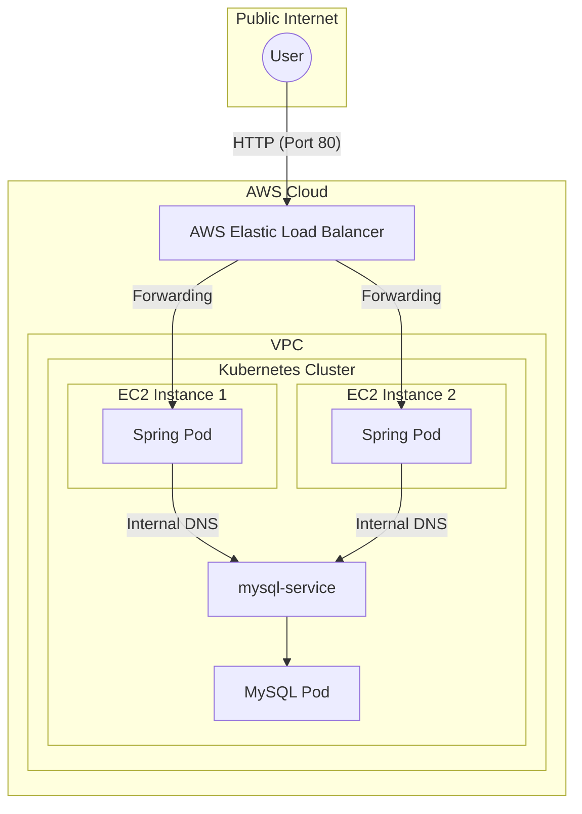

# [실습] AWS EC2에서 쿠버네티스를 활용해 배포하기

### ✅ 목표
- AWS EC2 인스턴스를 생성하고, 쿠버네티스 클러스터를 구축하거나 이미 구축된 환경에 애플리케이션을 배포하는 과정을 학습한다.
- 클라우드 환경에서의 서비스 노출 방식(LoadBalancer)과 보안 그룹(Security Group) 설정을 이해한다.

---

### 1. AWS 환경 준비

AWS에서 쿠버네티스를 운영하는 방법은 크게 두 가지가 있습니다.
1. **EKS (Elastic Kubernetes Service)**: AWS에서 제공하는 관리형 서비스 (권장)
2. **EC2에 직접 설치**: kubeadm 등을 사용하여 직접 마스터/워커 노드를 구성

본 실습에서는 **EC2 인스턴스에 쿠버네티스 환경이 준비되었다고 가정**하고, 애플리케이션을 배포하는 핵심 과정을 정리합니다.

#### 🛠️ 필요 사전 작업
- **EC2 인스턴스 생성**: Ubuntu 22.04 LTS 권장
- **보안 그룹(Security Group) 설정**:
  - `8080` (Spring Boot), `30000-32767` (NodePort 범위), `22` (SSH) 포트 개방
- **kubectl 설치**: 로컬 또는 EC2 인스턴스에 설치

---

### 2. 클라우드 배포를 위한 이미지 준비

로컬에서 빌드한 이미지는 EC2에서 직접 접근할 수 없습니다. 따라서 **Docker Hub**와 같은 이미지 레지스트리에 이미지를 푸시해야 합니다.

```bash
# 1. Docker Hub 로그인
$ docker login

# 2. 이미지 태그 생성 (자신의 Docker ID 사용)
$ docker tag spring-server [DOCKER_ID]/spring-server:latest

# 3. 이미지 푸시
$ docker push [DOCKER_ID]/spring-server:latest
```

---

### 3. AWS 환경에 맞는 매니페스트 수정

AWS EC2 환경에서는 로컬(`IfNotPresent`)과 달리 외부 레지스트리에서 이미지를 가져와야 하며, 서비스 타입도 클라우드 제공업체의 로드밸런서를 활용할 수 있습니다.

**spring-deployment-aws.yaml**
```yaml
apiVersion: apps/v1
kind: Deployment
metadata:
  name: spring-deployment
spec:
  replicas: 3
  selector:
    matchLabels:
      app: backend-app
  template:
    metadata:
      labels:
        app: backend-app
    spec:
      containers:
        - name: spring-container
          image: [DOCKER_ID]/spring-server:latest # 푸시한 이미지 경로
          imagePullPolicy: Always # 항상 최신 이미지를 가져옴
          ports:
            - containerPort: 8080
          env:
            - name: DB_HOST
              value: mysql-service
            - name: DB_PORT
              value: "3306"
            - name: DB_NAME
              value: kub-practice
            - name: DB_USERNAME
              value: root
            - name: DB_PASSWORD
              value: password123
```

**spring-service-aws.yaml**
```yaml
apiVersion: v1
kind: Service
metadata:
  name: spring-service
spec:
  type: LoadBalancer # AWS ELB(Elastic Load Balancer)를 자동으로 생성
  selector:
    app: backend-app
  ports:
    - protocol: TCP
      port: 80         # 로드밸런서 외부 포트
      targetPort: 8080 # 파드 내부 포트
```

---

### 4. 배포 및 서비스 확인

```bash
# 매니페스트 적용
$ kubectl apply -f spring-deployment-aws.yaml
$ kubectl apply -f spring-service-aws.yaml

# 서비스 상태 확인 (EXTERNAL-IP 확인)
$ kubectl get svc spring-service
```

- **EXTERNAL-IP**: AWS 환경에서는 로드밸런서의 DNS 주소(예: `abc...ap-northeast-2.elb.amazonaws.com`)가 할당됩니다. 이 주소로 접속하면 전 세계 어디서든 우리 서버에 접근할 수 있습니다.

---

### 5. AWS 배포 아키텍처 이해



---

### 6. 주의사항 (비용 및 보안)
1.  **비용 발생**: `LoadBalancer` 타입을 사용하면 AWS ELB 비용이 발생합니다. 실습이 끝나면 `kubectl delete`로 반드시 리소스를 삭제하세요.
2.  **보안 그룹**: EC2 인스턴스의 보안 그룹에서 노드 포트나 로드밸런서 포트가 열려 있는지 반드시 확인해야 합니다.
3.  **IAM 권한**: EKS를 사용할 경우, 로드밸런서를 생성할 수 있는 적절한 IAM Role이 노드에 부여되어 있어야 합니다.

---

### ✅ 요약
- 로컬 이미지는 외부 레지스트리(Docker Hub)에 푸시하여 사용한다.
- 클라우드 환경에서는 `LoadBalancer` 서비스를 통해 외부 트래픽을 효율적으로 관리한다.
- AWS 보안 그룹 설정을 통해 네트워크 접근을 제어한다.
