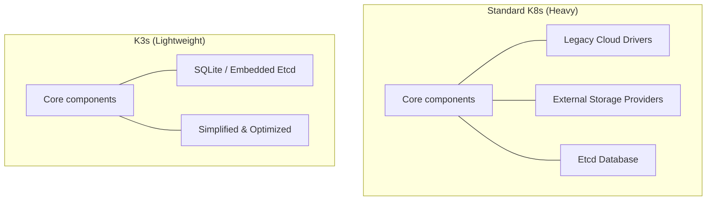

# k3s란? (경량화된 쿠버네티스)

### ✅ EC2에서 쿠버네티스(k8s)를 쓰는 게 학습에 도움이 안 되는 이유

쿠버네티스 학습을 가로막는 요소에는 크게 2가지가 있습니다.

1. **복잡한 설치 과정**
   쿠버네티스를 입문하는 입장이거나 DevOps 엔지니어가 되려는 사람이 아니라면 쿠버네티스를 직접 설치할 일은 극히 드뭅니다. 심지어 DevOps 엔지니어라고 할지라도 최근에는 AWS의 EKS(Elastic Kubernetes Service)와 같은 관리형 서비스를 사용하기 때문에 직접 설치하는 경우는 많지 않습니다.

2. **비용적인 부담 (EC2 인스턴스 다수 필요)**
   표준적인 쿠버네티스 클러스터를 구성하려면 최소 3대 이상의 EC2 인스턴스가 필요합니다(마스터 노드 1대, 워커 노드 2대 권장). 이는 실습 환경을 구축하는 데 비용적인 부담으로 다가와 자유로운 학습을 방해합니다.

위 2가지 문제점을 해결할 수 있는 최적의 대안이 바로 **k3s**입니다.

---

### ✅ k3s란?

**k3s**는 Rancher Labs에서 개발한 **쿠버네티스(k8s)의 경량화 버전**입니다. 설치가 매우 간단하며 컴퓨팅 리소스를 적게 소모하도록 설계되어, 저사양 기기나 단일 노드 환경에서도 완벽하게 동작합니다.

#### 🌟 k3s의 특징
- **경량화**: 쿠버네티스의 핵심 기능만 남기고 불필요한 기능을 제거하여 바이너리 크기가 매우 작습니다.
- **간편한 설치**: 명령어 한 줄로 설치가 완료됩니다.
- **저사양 최적화**: 메모리 사용량이 적어 t3.medium 이하의 작은 EC2 인스턴스에서도 원활하게 실행됩니다.
- **프로덕션 가능**: 가볍지만 실제 서비스 환경에서도 충분히 사용 가능한 안정성을 갖추고 있습니다.

---

### ✅ 왜 k3s를 사용해야 할까요?

1. **학습 효율 극대화**: 설치에 힘을 빼지 않고, 쿠버네티스의 실제 기능(Pod, Deployment, Service 등)을 학습하는 데 집중할 수 있습니다.
2. **비용 절감**: 단 한 대의 EC2 인스턴스만으로도 클러스터를 구축하여 모든 실습을 진행할 수 있습니다.
3. **빠른 환경 구성**: 실습 환경이 필요할 때마다 몇 분 안에 뚝딱 만들어낼 수 있습니다.

---

### 🎨 k3s vs k8s 비교 구조

| 비교 항목 | 쿠버네티스 (k8s) | k3s |
| :--- | :--- | :--- |
| **설치 난이도** | 높음 (kubeadm 등 사용) | 매우 낮음 (명령어 한 줄) |
| **최소 사양** | 2GB+ RAM 권장 | 512MB+ RAM 가능 |
| **데이터베이스** | etcd | SQLite (기본), etcd 등 선택 가능 |
| **권장 용도** | 대규모 엔터프라이즈 환경 | 엣지 컴퓨팅, IoT, 개발/학습 환경 |

이제 k3s를 통해 비용 부담 없이 클라우드 환경에서 쿠버네티스 실습을 시작해 보세요! 🚀
