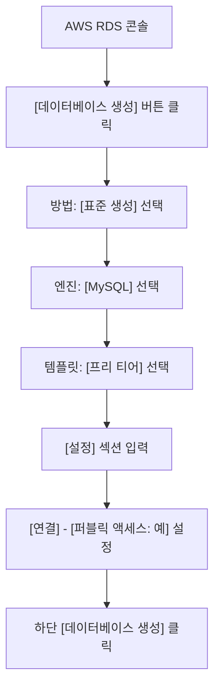
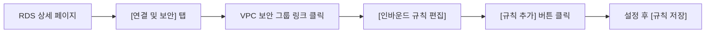
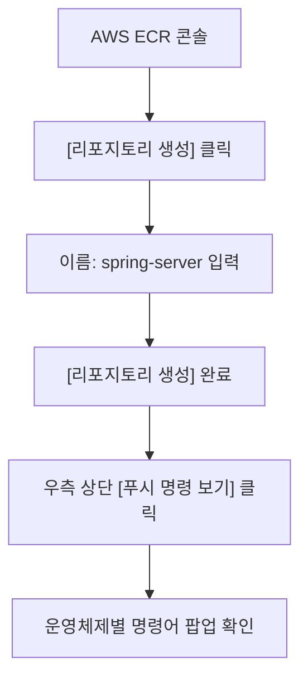

# AWS RDS 및 ECR 연동 가이드

이 문서는 AWS의 관리형 데이터베이스 서비스인 **RDS**와 컨테이너 이미지 저장소인 **ECR**을 활용하여 Spring Boot 애플리케이션을 배포하는 상세 설정을 설명합니다.

---

## 1. AWS RDS(MySQL) 설정

### 🛠️ RDS 인스턴스 생성 UI 흐름도



### ✅ RDS 인스턴스 상세 설정 정보

| 구분 | 항목 | 설정값 |
| :--- | :--- | :--- |
| **엔진** | 엔진 옵션 | MySQL |
| **템플릿** | 템플릿 종류 | 프리 티어 (학습용) |
| **설정** | DB 인스턴스 식별자 | `database-1` |
| **설정** | 마스터 사용자 이름 | `admin` |
| **설정** | 마스터 암호 | `password123` |
| **연결** | 퍼블릭 액세스 | **예** (외부 접속 허용) |

---

## 2. 보안 그룹(Security Group) 설정

RDS에 접근할 수 있도록 네트워크 대문을 여는 과정입니다.

### 🛠️ 보안 그룹 인바운드 규칙 설정 흐름



### ✅ 인바운드 규칙 입력값

| 유형 | 프로토콜 | 포트 범위 | 소스 | 비고 |
| :--- | :--- | :--- | :--- | :--- |
| **MYSQL/Aurora** | TCP | 3306 | `0.0.0.0/0` 또는 `Anywhere` | (테스트용) 전체 허용 |
| **MYSQL/Aurora** | TCP | 3306 | `sg-xxxxxx` (EC2 보안그룹 ID) | **(권장)** EC2만 허용 |

---

## 3. AWS ECR(이미지 저장소) 설정

### 🛠️ ECR 리포지토리 생성 및 푸시 흐름



### ✅ 로컬에서 ECR로 이미지 푸시 과정
팝업창에 나타나는 4개의 명령어를 순서대로 터미널에 입력하세요.

1.  **인증**: AWS CLI를 통해 ECR에 로그인합니다.
2.  **빌드**: Docker 이미지를 생성합니다.
3.  **태그**: ECR 주소에 맞게 이미지에 이름을 붙입니다.
4.  **푸시**: ECR 저장소로 이미지를 전송합니다.

---

## 4. 쿠버네티스(k3s) 배포 설정

### ✅ 환경 변수 주입 (Deployment)
애플리케이션이 RDS에 접속할 수 있도록 `DB_HOST`, `DB_NAME`, `DB_USERNAME`, `DB_PASSWORD` 등을 환경 변수로 설정합니다.

```yaml
env:
  - name: DB_HOST
    value: "database-1.xxxxxx.ap-northeast-2.rds.amazonaws.com" # RDS 엔드포인트
  - name: DB_PORT
    value: "3306"
  - name: DB_NAME
    value: "kub_practice"
  - name: DB_USERNAME
    value: "admin"
  - name: DB_PASSWORD
    value: "password123"
```

### ✅ 이미지 경로 수정
`image` 항목을 방금 푸시한 ECR 이미지 경로로 수정합니다.
```yaml
image: [AWS_ACCOUNT_ID].dkr.ecr.[REGION].amazonaws.com/spring-server:latest
imagePullPolicy: Always
```

---

## 4. 요약 및 주의사항
- **보안**: RDS 암호나 ECR 주소와 같은 민감한 정보는 실제 운영 환경에서는 **Secret** 오브젝트를 사용하여 관리하는 것이 좋습니다.
- **비용**: RDS와 ECR은 사용량에 따라 비용이 발생할 수 있으므로, 실습 후에는 리소스를 삭제하거나 중지하는 것을 권장합니다.
- **네트워크**: EC2와 RDS가 같은 VPC 내에 있는 경우 내부 통신이 가능하도록 라우팅 및 보안 그룹이 적절히 설정되어야 합니다.
