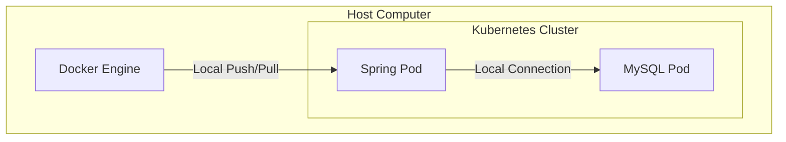

# [예제] 백엔드(Spring Boot) 서버 배포하기, DB 연동하기 (+ RDS, ECR)

### ✅ 목표
- EC2(k3s) 환경에서 Spring Boot 서버를 배포하고, 외부 서비스인 **AWS RDS(MySQL)** 및 **AWS ECR(이미지 저장소)**을 연동하는 실무적인 아키텍처를 학습한다.

---

## 1. 로컬 vs 배포 환경 아키텍처 비교

### 🏠 로컬 환경 아키텍처
- **이미지 저장소**: 로컬 Docker 엔진에 저장
- **데이터베이스**: 클러스터 내부의 MySQL 파드 사용
- **특징**: 설정이 간단하지만, 실제 운영 환경과는 거리가 있음



### ☁️ 클라우드 배포 환경 아키텍처 (RDS, ECR 활용)
- **이미지 저장소**: **AWS ECR** (관리형 컨테이너 레지스트리)
- **데이터베이스**: **AWS RDS** (관리형 DB 서비스)
- **특징**: 보안성이 높고 데이터 보존 및 이미지 관리가 용이함

```mermaid
flowchart TD
    subgraph Internet [Public Internet]
        User((User))
    end

    subgraph AWS_Cloud [AWS Cloud]
        ELB[AWS Elastic Load Balancer]
        
        subgraph VPC [VPC]
            subgraph K8s_Cluster [Kubernetes Cluster / EC2]
                Spring_Pod1[Spring Pod]
                Spring_Pod2[Spring Pod]
            end
            
            RDS[(AWS RDS MySQL)]
        end
        
        ECR[AWS ECR Registry]
    end

    %% Flow
    User -- "1. Request (Port 80)" --> ELB
    ELB -- "2. Load Balancing" --> Spring_Pod1
    ELB -- "2. Load Balancing" --> Spring_Pod2
    
    Spring_Pod1 -- "3. Data Query" --> RDS
    Spring_Pod2 -- "3. Data Query" --> RDS
    
    ECR -- "4. Image Pull" -.-> K8s_Cluster
    
    %% Styling
    style AWS_Cloud fill:#f9f9f9,stroke:#333,stroke-width:2px
    style VPC fill:#ffffff,stroke:#333,stroke-dasharray: 5 5
    style K8s_Cluster fill:#e1f5fe,stroke:#01579b
    style RDS fill:#fff3e0,stroke:#e65100
    style ECR fill:#e8f5e9,stroke:#1b5e20
    style ELB fill:#e0f2f1,stroke:#004d40
```

로컬 환경에서의 아키텍처와의 차이점은 크게 2가지이다.

1. **로컬에 도커 이미지를 저장하지 않고, 외부 저장소인 AWS ECR에 도커 이미지를 저장한다.**
2. **로컬의 데이터베이스를 사용하지 않고, 외부 데이터베이스인 AWS RDS를 활용한다.**

위의 아키텍처로 환경을 구성해보자.

---

## 2. AWS ECR에 이미지 푸시하기

로컬에서 빌드한 이미지를 클라우드에서 사용할 수 있도록 ECR에 업로드합니다.

```bash
# 1. ECR 로그인 (AWS CLI 설치 및 자격 증명 설정 필요)
$ aws ecr get-login-password --region [REGION] | docker login --username AWS --password-stdin [AWS_ACCOUNT_ID].dkr.ecr.[REGION].amazonaws.com

# 2. 이미지 태그 생성
$ docker tag spring-server:latest [AWS_ACCOUNT_ID].dkr.ecr.[REGION].amazonaws.com/spring-server:latest

# 3. 이미지 푸시
$ docker push [AWS_ACCOUNT_ID].dkr.ecr.[REGION].amazonaws.com/spring-server:latest
```

---

## 3. AWS RDS 설정 및 보안 그룹 확인

1.  **RDS 생성**: MySQL 엔진을 선택하여 RDS 인스턴스를 생성합니다.
2.  **보안 그룹 설정**: RDS의 보안 그룹(Inbound 규칙)에서 **EC2 인스턴스의 보안 그룹 ID**로부터의 `3306` 포트 접근을 허용해야 합니다. (매우 중요!)

---

## 4. 쿠버네티스 매니페스트 작성

### spring-deployment-aws.yaml
외부 저장소(ECR)와 외부 DB(RDS) 정보를 포함하도록 설정합니다.

```yaml
apiVersion: apps/v1
kind: Deployment
metadata:
  name: spring-deployment-aws
spec:
  replicas: 3
  selector:
    matchLabels:
      app: backend-app
  template:
    metadata:
      labels:
        app: backend-app
    spec:
      containers:
        - name: spring-container
          image: [AWS_ACCOUNT_ID].dkr.ecr.[REGION].amazonaws.com/spring-server:latest # ECR 이미지 경로
          imagePullPolicy: Always
          ports:
            - containerPort: 8080
          env:
            - name: DB_HOST
              value: "database-1.xxxxxx.ap-northeast-2.rds.amazonaws.com" # RDS 엔드포인트
            - name: DB_PORT
              value: "3306"
            - name: DB_NAME
              value: "kub_practice"
            - name: DB_USERNAME
              value: "admin"
            - name: DB_PASSWORD
              value: "your_password"
```

---

## 5. 배포 및 확인

```bash
# 매니페스트 적용
$ kubectl apply -f spring-deployment-aws.yaml
$ kubectl apply -f spring-service-aws.yaml

# 배포 상태 확인
$ kubectl get pods
$ kubectl get svc spring-service-aws
```

---

## 💡 주요 차이점 요약

1.  **이미지 저장소 분리**: 로컬에 의존하지 않고 전 세계 어디서든 접근 가능한 **ECR**을 사용합니다.
2.  **데이터베이스 분리**: 클러스터 장애 시에도 데이터가 안전하게 보호되는 **RDS**를 사용하며, 고가용성(Multi-AZ)과 백업 기능을 활용할 수 있습니다.
3.  **네트워크 보안**: 서비스 간 통신 시 **보안 그룹(Security Group)**을 통해 필요한 포트만 개방하여 보안을 강화합니다.

이제 여러분의 서비스는 실제 상용 환경과 유사한 구조로 배포되었습니다! 🚀
